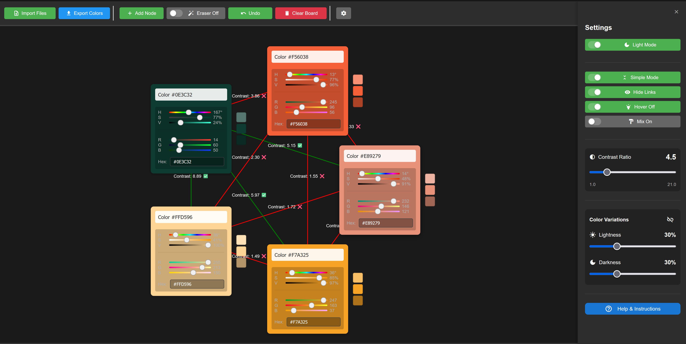
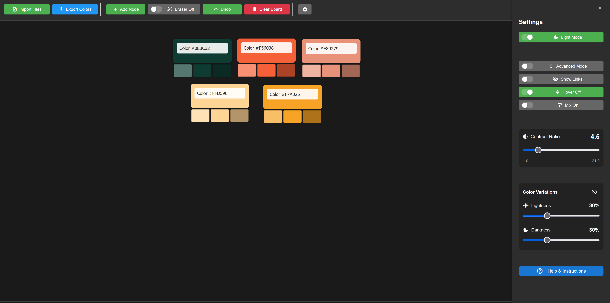
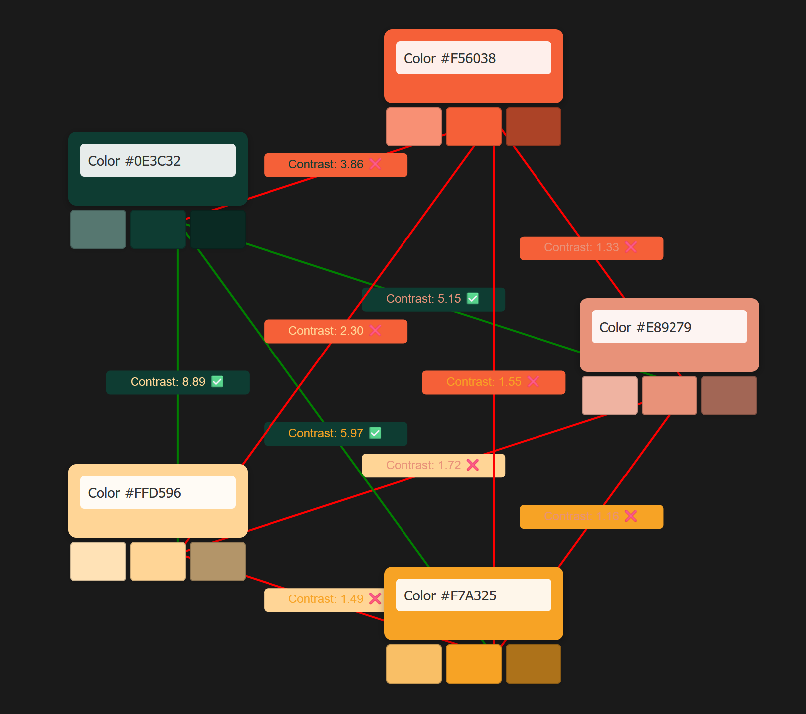
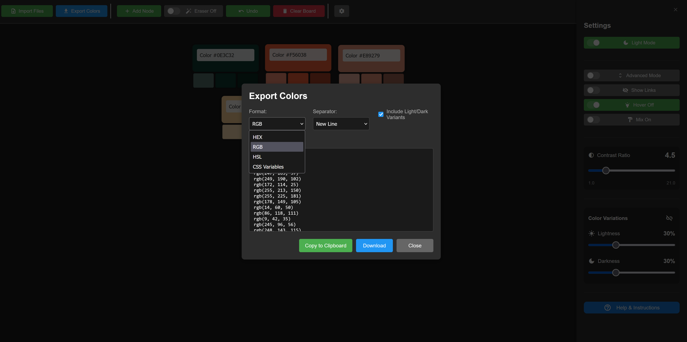

# React Color Factory



A powerful, interactive color palette creation and management tool built with React and TypeScript.

## Features

- **Interactive Color Node System**: Create, connect, and organize color nodes to build beautiful color palettes
- **Advanced Color Operations**: Analyze and manipulate colors with tools for contrast calculation and color clustering
- **K-Means Color Extraction**: Extract dominant colors from images using K-means clustering algorithm
- **Customizable Workspace**: Adjust layout, visibility, and appearance settings to suit your workflow
- **Export Options**: Save your color palettes in various formats for use in your projects
- **Undo/Redo Functionality**: Full history management for all operations
- **Accessibility Features**: Contrast ratio calculations following WCAG guidelines
- **Dark/Light Mode**: Switch between dark and light interface modes


*Simplified presentation mode for clean color palette visualization*

## Getting Started

### Prerequisites

- Node.js (v14.0.0 or higher)
- npm or yarn

### Installation

1. Clone the repository:
   ```bash
   git clone https://github.com/yourusername/react-colorfactory.git
   cd react-colorfactory
   ```

2. Install dependencies:
   ```bash
   npm install
   # or
   yarn install
   ```

3. Start the development server:
   ```bash
   npm start
   # or
   yarn start
   ```

4. Open your browser and navigate to `http://localhost:3000`

## Usage

### Creating Color Nodes
- Click on the workspace to create a new color node
- Use the color picker to select colors
- Connect nodes by dragging from one node to another


*Preview mode showing color mixing and node connections*

### Importing Colors
- Import colors from images using the K-means extraction tool
- Import from text files containing color values

### Organizing Your Palette
- Drag nodes to rearrange
- Use the auto-layout feature to organize nodes
- Group related colors with connections

### Exporting
- Export your palette in various formats (CSS, SCSS, JSON, etc.)
- Copy individual color values or entire palettes


*Export interface showing various export options and formats*

## Tech Stack

- React
- TypeScript
- Material-UI
- HTML Canvas (for workspace rendering)

## License

This project is licensed under the MIT License - see the LICENSE file for details.

## Acknowledgments

- Color science algorithms and formulas
- K-means clustering implementation for color extraction
- WCAG contrast guidelines for accessibility features
